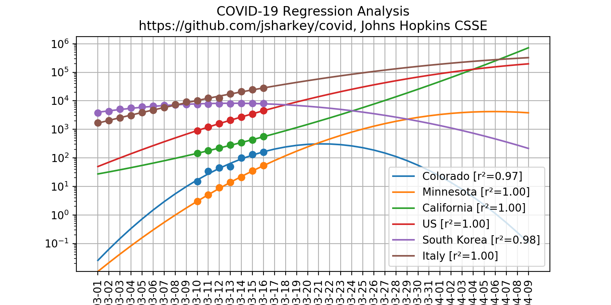

# COVID-19 Regression Analysis

This script uses the latest data from 
[2019 Novel Coronavirus COVID-19 (2019-nCoV) Data Repository by Johns Hopkins CSSE](https://github.com/CSSEGISandData/COVID-19/) to form  completely naïve regression analysis.

